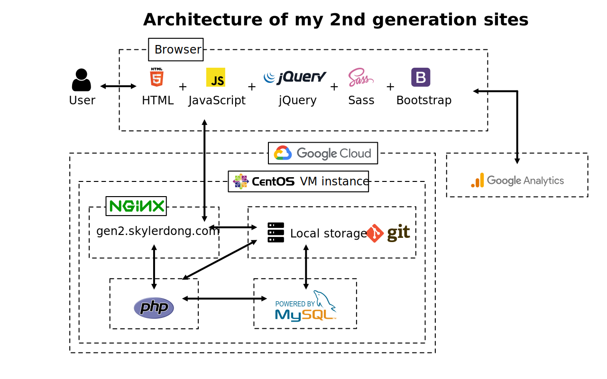

# Working Repository for My 2nd-Generation Personal Website

Website: [https://gen2.skylerdong.com](https://gen2.skylerdong.com)

Repository: [https://github.com/dongskyler/skylerdong.com-gen2](https://github.com/dongskyler/skylerdong.com-gen2)

***

## Description

This is the working repository for my 2nd-generation personal website. It was established in early 2020 and built with Bootstrap 4, Sass, JQuery, vanilla PHP and MySQL.

***

## Architecture

***

## Other generations of my personal website

- [3rd generation of my website](https://skylerdong.com), built with TypeScript React and Sass, with its back-end supported by [api.skylerdong.com](api.skylerdong.com).
- [1st generation of my website](https://gen1.skylerdong.com/), which was established in 2015 and built with a Google Site template.

***

## Copyright Notice

The software is under MIT license. You are welcome to use it.

However, my images are not. It is always appreciated when you refer back to my website. However, all images appearing on this domain and all subdomains are not to be downloaded or reproduced in any way without permission. If you intend to use my images by any means or purchase prints, you are welcome to contact me. Thank you.
